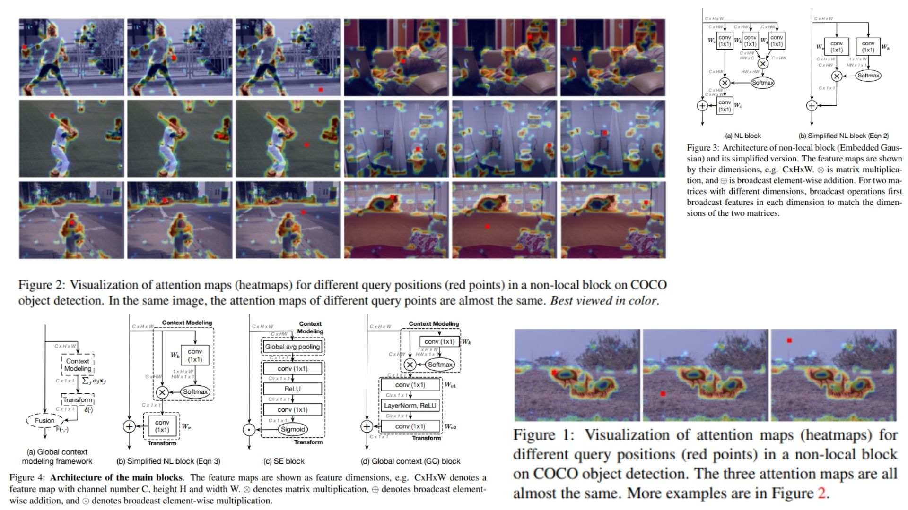

# 🌐 GCNet-Replication – Global Context for CNNs

This repository provides a **PyTorch-based replication** of  
**GCNet: Non-local Networks Meet Squeeze-Excitation Networks and Beyond**.

The focus is **understanding and implementing global context (GC) mechanisms** practically,  
rather than chasing benchmark SOTA results.

- Aggregates **long-range dependencies** efficiently 🌟  
- Combines **simplified non-local context with feature transforms** 🌀  
- Lightweight & modular, **plug-and-play for any CNN backbone** ⚙️  

**Paper reference:** [GCNet – Cao et al., 2020](https://arxiv.org/abs/1904.11492) 📄

---

## 🌌 Overview – GC Pipeline



The core idea:

> Capture **query-independent global context** efficiently and integrate it back to features to model long-range dependencies without full self-attention.

High-level procedure:

1. Extract feature maps $X \in \mathbb{R}^{C \times H \times W}$ from a CNN backbone.  
2. Compute **spatial attention map** $A \in \mathbb{R}^{1 \times H \times W}$:  
   $$A = \text{Softmax}(\text{Conv}_{1\times1}(X))$$
3. Aggregate **global context vector** $C \in \mathbb{R}^{C \times 1 \times 1}$:  
   $$C = \sum_{i,j} X_{:,i,j} \cdot A_{i,j}$$
4. Transform context through **1x1 convolution + LayerNorm + ReLU**:  
   $$C' = F_\text{transform}(C)$$
5. Fuse back with original feature map:  
   $$X' = X + C'$$
6. Optionally, add **SE-style channel attention** for additional refinement:  
   $$S = \sigma(W_2 \cdot \text{ReLU}(W_1 \cdot \text{GAP}(X'))), \quad X'' = X' \otimes S$$  

The module can be inserted **per convolution block** and is fully **end-to-end trainable**.

---

## 🧮 GC Computation – Math Essentials

### Global Context (Simplified Non-local)
Given feature map $X$, spatial attention $A$:

$$
C = \sum_{i,j} \alpha_{i,j} X_{:,i,j}, \quad
\alpha = \text{Softmax}(X_\text{conv})
$$

Transform and fuse:

$$
X' = X + F_\text{transform}(C)
$$

Where:  
- $F_\text{transform}$ = 1x1 Conv → LayerNorm → ReLU → 1x1 Conv  
- $X'$ = final feature map with integrated global context  

### Optional SE-style Refinement
Compute channel-wise attention vector:

$$
S = \sigma(W_2 \cdot \text{ReLU}(W_1 \cdot \text{GAP}(X'))) 
\quad \text{and} \quad X'' = X' \otimes S
$$

Where $\sigma$ is the sigmoid function and $\otimes$ denotes element-wise multiplication along channels.

---

## 🧠 What the Module Does

- Efficiently models **long-range dependencies** without full self-attention  
- Integrates **global context** with **transform + fusion**  
- Optional **SE-style refinement** enhances channel-wise importance  
- Lightweight, minimal extra parameters, fully modular in any CNN backbone

---

## 📦 Repository Structure

```bash
GCNet-Replication/
├── src/
│   ├── layers/
│   │   ├── conv_layer.py          # Conv2d wrapper (1x1, 3x3, etc.)
│   │   ├── activation.py          # ReLU, Softmax helpers
│   │   └── normalization.py       # BatchNorm or LayerNorm
│   │
│   ├── context/
│   │   ├── attention_pool.py      # Spatial attention (Conv + Softmax)
│   │   ├── global_context.py      # Aggregate context (sum over spatial)
│   │   └── transform.py           # 1x1 Conv → LayerNorm → ReLU → 1x1 Conv
│   │
│   ├── backbone/
│   │   └── resnet_blocks.py       # CNN block + optional GC/SE
│   │
│   ├── model/
│   │   └── gc_cnn.py              # Backbone + GC forward logic
│   │
│   └── config.py                  # GC reduction, use_gc, use_se, block positions
│
├── images/
│   └── figmix.jpg                  # GC overview figure
│
├── requirements.txt
└── README.md
```
---


## 🔗 Feedback

For questions or feedback, contact: [barkin.adiguzel@gmail.com](mailto:barkin.adiguzel@gmail.com)
